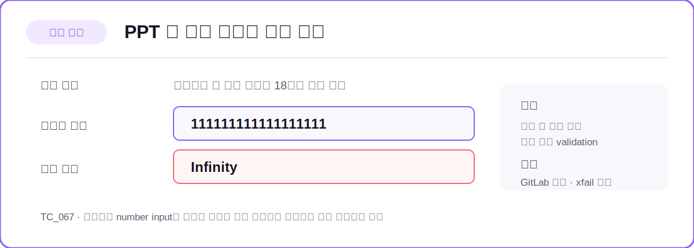

# AI HelpyChat QA Automation

> 생성형 AI 기반 문서·콘텐츠 생성 서비스의 사용자 흐름을 검증하고,
> 실패 원인을 추적할 수 있는 증거를 수집하도록 설계한 E2E QA 프로젝트입니다.


## 프로젝트 한눈에 보기

| 항목 | 내용 |
|---|---|
| 대상 서비스 | AI Helpy Chat - 채팅, 검색, 에이전트, AI 문서·콘텐츠 생성 서비스 |
| 프로젝트 기간 | 2026.05.13 ~ 2026.06.01 |
| 구성 | QA 5명 |
| 담당 영역 | PPT 생성, 퀴즈 생성, 심층 조사 |
| 주요 역할 | TC 수행, 시나리오 설계·자동화, 결함 리포트, 회귀 테스트, 결과 문서화, CI/CD 연동 |
| 주 실행 환경 | Windows + Chrome |
| 교차 브라우저 | Edge, Firefox |
| 핵심 링크 | [GitHub 저장소](https://github.com/Hyunmyung-1206/AI_Helpy_chat) · [QA 최종 산출물](https://dirt-brand-7d0.notion.site/AI-337f6266ce2a8077a9d4ea1b6878a38d) |


PPT·퀴즈·심층 조사 기능을 중심으로 정상 흐름과 입력값 검증, 생성·중지·다운로드 흐름을 확인했습니다.

## 성과 대시보드

### 개인 기여

| 담당 TC 수행 | pytest 수집 아이템 | PPT | 퀴즈 | 심층 조사 |
|---:|---:|---:|---:|---:|
| **94건** | **36개** | 21개 | 8개 | 7개 |

### 팀 전체 결과

| 전체 TC | Pass | Fail | 실행 Pass rate | 자동화 시나리오 | GitLab 등록 이슈 |
|---:|---:|---:|---:|---:|---:|
| **198건** | **180건** | **9건** | **95.24%** | **43개** | **13건** |

| 자동화 결과 |
|---|
| Pass 36 / Xfail 6 / N/A 1 |

> `N/A 1건`은 이미지 다운로드 버튼을 눌러도 파일이 저장되지 않는 서비스 결함으로 실행에서 제외했습니다.

## QA 역할과 테스트 전략

| 구분 | 수행 내용 |
|---|---|
| 테스트 설계 | 사용자 흐름을 기준으로 정상·예외·경계값 TC와 E2E 시나리오 설계 |
| 수동 검증 | UI 상태, 사용성, 생성 결과 품질, 브라우저 외부 동작 확인 |
| 자동화 검증 | 반복 가능한 기능 흐름, 입력값 validation, 생성·중지·다운로드, 회귀 테스트 |
| 결함 관리 | 재현 절차와 증거를 GitLab Issue로 등록하고 알려진 결함은 `xfail`로 추적 |
| 결과 관리 | 실행 결과와 실패 로그·스크린샷을 문서화하고 Slack/Jira 알림 연동 |
| CI/CD | GitLab CI와 `pytest-xdist`를 활용해 빠른 회귀 테스트 구성 |

### 검증 범위

| 영역 | 주요 검증 내용 |
|---|---|
| PPT 생성 | 입력값 경계, 긴 숫자, 생성·중지, PPTX 다운로드 |
| 퀴즈 생성 | 유형·난이도 선택, 필수값·공백값, 객관식·주관식 생성 |
| 심층 조사 | 주제·지시사항 validation, 생성·중지, Markdown 다운로드 |
| 채팅·검색 | 메시지 전송, 새 대화, LNB 관리, 검색 결과와 초기화 |
| 에이전트 | 생성, 검색, 필터, 내 에이전트 이동 |
| 교육 문서 | 세부특기사항, 행동특성 및 종합의견, 수업지도안 |

## 대표 TC


퀴즈 생성 영역의 페이지 진입, 드롭다운 선택, 입력값 검증 등 담당 TC 일부입니다. 테스트 절차와 기대 결과를 정의하고, 실행 결과와 자동화 가능 여부를 함께 관리했습니다.

[대표 TC 전체 보기](https://docs.google.com/spreadsheets/d/1R24dfcDsivm6yWTJz2Oj3y6AGdKaAZlKfFPfn8COe5Q/edit?gid=1990639038#gid=1990639038)

## 대표 시나리오


PPT 정상 생성, PPTX 다운로드 파일 검증, 주제 입력값 경계 검증 시나리오입니다. 사용자 흐름을 단계별로 정의하고 각 시나리오를 관련 TC와 연결해 추적 가능하도록 관리했습니다.

[대표 시나리오 전체 보기](https://docs.google.com/spreadsheets/d/1R24dfcDsivm6yWTJz2Oj3y6AGdKaAZlKfFPfn8COe5Q/edit?gid=200726426#gid=200726426)

## 대표 결함 사례

| 결함 | 재현 절차 | 기대 결과 | 실제 결과 | 관리 |
|---|---|---|---|---|
| PPT 긴 숫자 입력값 변환 | PPT 생성 진입 → 슬라이드/섹션 수에 긴 숫자 입력 | 원본 유지 또는 허용 범위 validation | 값이 `Infinity`로 변환 | GitLab 등록, `xfail` 추적 |
| 공백 주제 허용 | PPT 또는 심층 조사 진입 → 주제에 공백만 입력 | 필수값 오류와 생성 버튼 비활성화 | 공백이 유효값으로 처리되어 버튼 활성화 | GitLab 등록, `xfail` 회귀 관리 |



긴 숫자 입력 시 사용자 입력과 실제 출력이 달라지는 문제를 결함으로 등록하고 CI에서 지속 추적했습니다. 상세 증거는 [공개 QA 산출물](https://dirt-brand-7d0.notion.site/AI-337f6266ce2a8077a9d4ea1b6878a38d)에서 확인할 수 있습니다.

## 이슈 추적 과정


- 수동 테스트에서 발견한 제품 결함과 UX 개선 요청은 GitLab Issue로 관리했습니다.
- 자동화 실패 시에는 로그·스크린샷을 남기고 Slack 요약 알림과 Jira 티켓 생성을 연동했습니다.
- 알려진 제품 결함은 `skip`으로 숨기지 않고 `xfail`로 남겨 수정 여부를 감지했습니다.

### UX 개선 제안

문서 생성 페이지를 나갔다가 다시 진입해도 이전 입력값이 유지되어, 새로운 문서를 작성하려면 값을 하나씩 지워야 했습니다. 입력 필드를 한 번에 비우는 **초기화 버튼**을 제공하면 반복 작성 흐름의 불편을 줄일 수 있다고 제안했습니다.

## Troubleshooting

| 문제 | 분석·개선 | 결과 |
|---|---|---|
| E2E 직렬 실행의 긴 피드백 시간 | `pytest-xdist -n 3` 적용, fast/slow 테스트 분리 | **11분 13초 → 3분 50초**, 65.8% 단축 |
| PPT 테스트의 긴 함수와 중복 | POM·공통 헬퍼·`parametrize`로 조작과 검증 책임 분리 | 실패 지점과 TC 의도 명확화 |
| 로컬마다 다른 다운로드 경로로 인한 테스트 오류 | 개인 로컬의 고정 다운로드 경로를 제거하고 테스트별 임시 다운로드 폴더를 생성했습니다. 다운로드 파일 개수가 0개에서 1개로 변하는지 확인한 뒤 검증 파일을 삭제하고, 테스트 종료 시 임시 폴더가 정리되도록 구성했습니다. | 로컬 환경별로 다운로드 경로를 변경하지 않아도 테스트가 Pass하는 것을 확인했습니다. |
| 알려진 제품 결함의 CI 실패 | `xfail`로 공백·긴 숫자 결함 관리 | 알려진 결함을 CI 결과에 유지하고 지속 추적 |

## 자동화 구조

```text
AI_Helpy_chat/
├── config/          # URL, 계정, 다운로드, 알림 설정
├── pages/           # Selenium Page Object
├── tests/           # pytest E2E 시나리오
├── utils/           # Slack/Jira 알림
├── logs/            # 실행 로그와 실패 스크린샷
├── conftest.py      # WebDriver, fixture, 실패 후처리
├── pytest.ini       # marker와 로그 설정
└── .gitlab-ci.yml   # Windows Runner CI 파이프라인
```

## 회고

| 구분 | 내용 |
|---|---|
| 잘한 점 | 정상 흐름뿐 아니라 공백·경계값·긴 숫자 등 예외 조건을 추가해 실제 결함을 발견하고 회귀 포인트로 남겼습니다. |
| 아쉬운 점 | 초기에는 정상 흐름 중심으로 설계해 예외 케이스와 실행 환경 차이를 뒤늦게 보완했습니다. |
| 다음 개선 | Docker로 브라우저·의존성 환경을 표준화하고, 생성 파일의 내부 구조와 콘텐츠 품질까지 자동 검증하고 싶습니다. |

## 기술 스택과 협업 도구

| 구분 | 도구 |
|---|---|
| Language / Test | Python, pytest |
| UI Automation | Selenium WebDriver, Page Object Model |
| Parallel / CI | pytest-xdist, GitLab CI, Windows Runner |
| Defect / Report | GitLab Issues, Jira, Slack, Notion |
| Browser | Chrome, Edge, Firefox |
